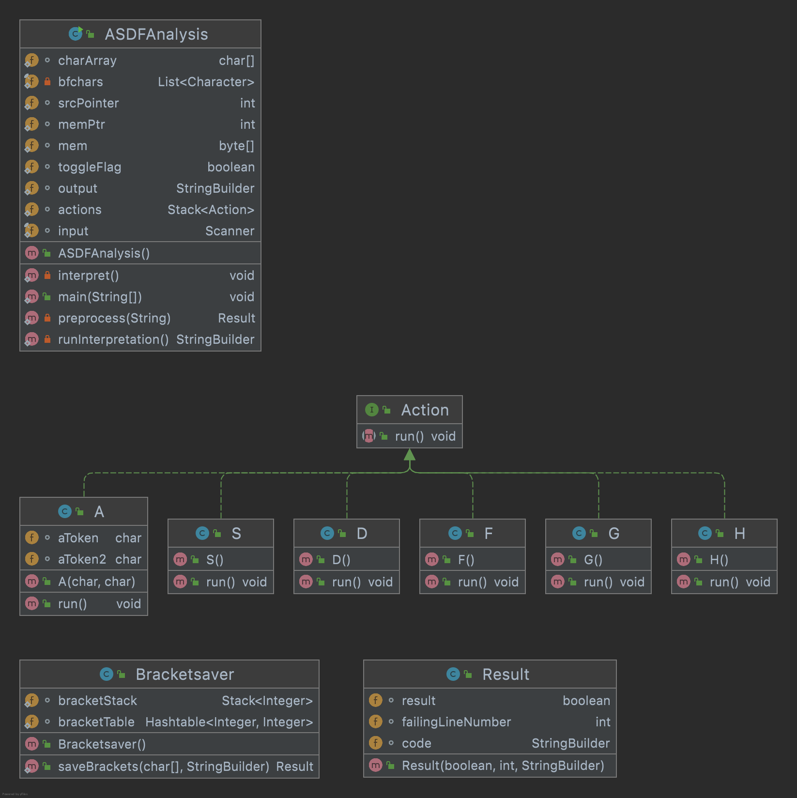

[[section-building-block-view]]

== Building Block View

=== Important Interfaces

==== Syntax handling

===== Purpose/Responsibility
To secure valid syntax a good syntax handling is indispensable.

[source, java]
----
include::../../src/Bracketsaver.java[tags=exception]
----
This is the handling of a error if the syntax of the brackets(d and f) isn't valid.

=== Level 2

==== Class Diagram

==== Action
[source, java]
----
include::../../src/Action.java[]
----
This is the central interface Action and it has a method run.
Every class that implements this interface has to override this run function.

==== Why implemented with Interface
This is very good, because for example a A and a S object both have a run function which makes the code execution simpler as seen below.
[source, java]
----
include::../../src/ASDFAnalysis.java[tags=runCode]
----

==== Bracketsaver and Result
[source, java]
----
include::../../src/Bracketsaver.java[]
----
The Bracketsaver saves all d -> f pairs and saves them into a Hashtable.

==== A - H

The classes A - H do the things as explained in chapter 3.

This is how the letter a is implemented. The class A needs two arguments in the constructor, to detect if it has to write to the output.
[source, java]
----
include::../../src/A.java[]
----

