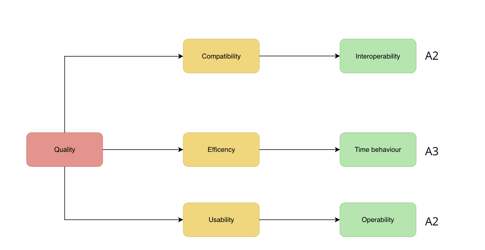

[[section-quality-scenarios]]
== Quality Requirements

=== Quality Tree

=== Quality Scenarios
[cols="e,2e" options="header"]
|===
| A1 | Quality concept is ok and beginner-friendly.
| A2 | Quality concept is excellent and it contains intermediate concepts...
| A3 | Concept is perfect and a joy to look at.
|===

